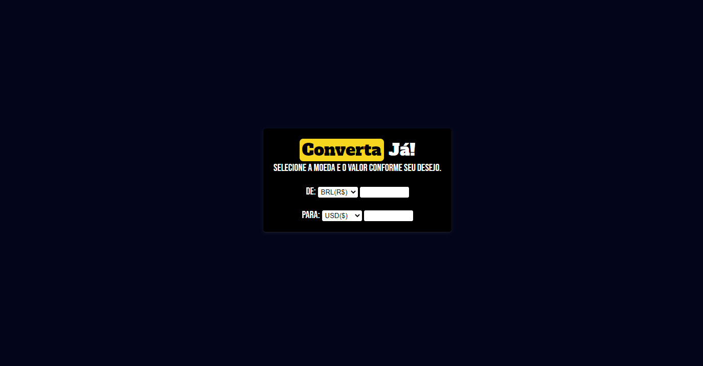
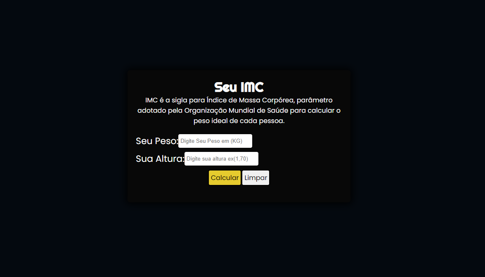

# Mini Projetos em JavaScript
 Alguns mini-projetos feitos em JavaScript, com o intuito de praticar e ajudar quem precisa de ajuda em alguma parte

 ## Conversor de moeda com API
 
 <h4 align="center"> <a href="https://apenasopedro.github.io/Treinos-em-JavaScript/CONVERSOR_DE_MOEDA/">Confira Aqui</a> </h4>
 
Conversor de moedas em tempo real, utilizando as moedas: Real, Dólar e Euro.

<h2>Tecnologias Usadas:</h2>

<li>HTML, CSS
<li>JavaScript

<h2>API:</h2>
<li> <a href="https://docs.awesomeapi.com.br/api-de-moedas">AwesomeAPI</a>

 ## Cálculo de IMC
 
 <h4 align="center"> <a href="https://apenasopedro.github.io/Treinos-em-JavaScript/IMC/">Confira Aqui</a> </h4>
 
Cálculo de IMC (Indice de Massa Corporal)

<h2>Tecnologias Usadas:</h2>

<li>HTML, CSS
<li>JavaScript

